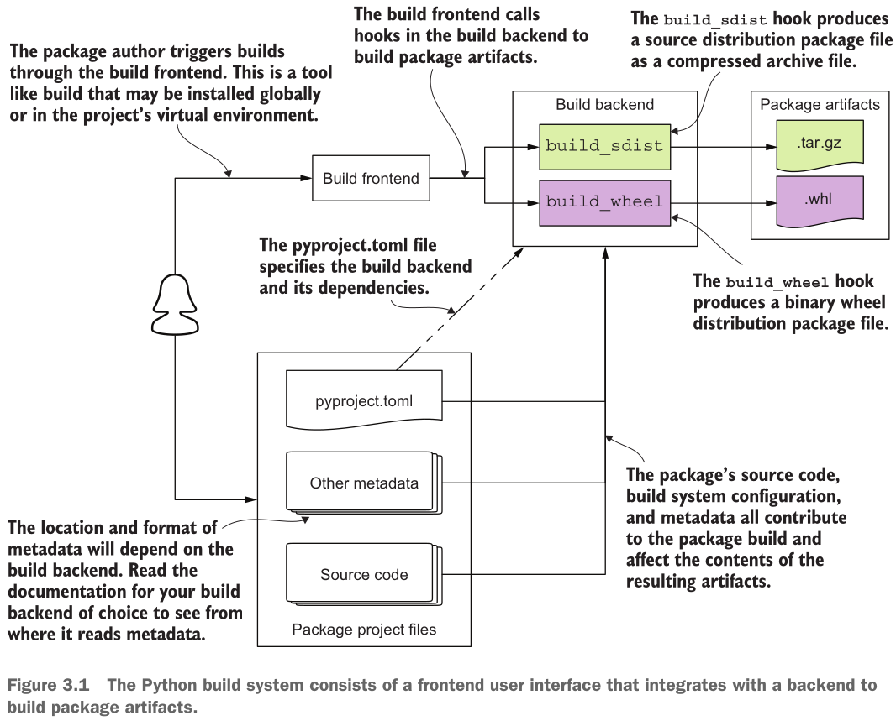

# Быстрое начало

"Привет-мир'овый" проект - простое "эхо" приложение с CLI и GUI.

## Содержание

- [Привет, сборка!](#привет-сборка)
- [Итоги](#итоги)
- [Ссылки](#ссылки)

### Привет, сборка!

Что можно сделать, но не нужно:

- `uv venv` - создаст виртуальное окружение по месту вызова (например, из директории с этой заметкой), а версию интерпретатора подглядит в корневом [.python-version](../../.python-version) файле (если нужна отдельная, можно, например, так: `uv venv --python 3.12`).
- ` uv pip install build` - установит в виртуальное окружение проекта [фронтенд](https://packaging.python.org/en/latest/glossary/#term-Build-Frontend)-программу сборки [build][build] (фронтенд предоставляет пользовательский интерфейс для сборки пакетов: сам собирать не умеет, но умеет поручать это дело программам-[бэкэндами](https://packaging.python.org/en/latest/glossary/#term-Build-Backend)).

Создаю заготовку проекта `echoer`:

```shell
╰─➤  uv init echoer
Initialized project `echoer` at `/home/stankudrow/Projects/Learning-Python-Packaging/notes/ch01/echoer`
╰─➤  tree echoer
echoer
├── main.py
├── pyproject.toml
└── README.md

1 directory, 3 files
```

Его уже можно собирать, но в таком виде он не нужен, потому что необходимо:

- переписать "pyproject.toml" под нужды проекта, [руководство](https://packaging.python.org/en/latest/guides/writing-pyproject-toml/) в помощь;
- добавить основные зависимости:
  - [click](https://pypi.org/project/click/) для поддержки CLI -> `uv add "click~=8.5"`;
  - [PyQT6](https://pypi.org/project/PyQt6/) для "умощнения" (empowerment) GUI -> `uv add "PyQt6~=6.11"`;
- прибавить (dev) зависимости (`uv add --group lint ruff ty`):
  - причёсыватель (линтеры) [ruff](https://docs.astral.sh/ruff/);
  - статический проверяльщик (чекер) [ty](https://docs.astral.sh/ty/);
- описать README проекта.

**Внимание**. Основные зависимости поставлены с обозначителем версии `~=` - это для более жёсткого задания границ допустимых изводов (версий), а значит большей устойчивости проекта. А разработческие зависимости поставлены как есть, они не должны и не влияют на основную установку пакета.

Когда всё сделано, остаётся собрать проект: `uv build echoer` (если из текущего пути) или `uv build` если из директории "echoer":

```shell
╰─➤  uv build --no-cache
Building source distribution...
running egg_info
creating echoer.egg-info
writing echoer.egg-info/PKG-INFO
writing dependency_links to echoer.egg-info/dependency_links.txt
writing entry points to echoer.egg-info/entry_points.txt
writing requirements to echoer.egg-info/requires.txt
writing top-level names to echoer.egg-info/top_level.txt
writing manifest file 'echoer.egg-info/SOURCES.txt'
reading manifest file 'echoer.egg-info/SOURCES.txt'
writing manifest file 'echoer.egg-info/SOURCES.txt'
running sdist
running egg_info
writing echoer.egg-info/PKG-INFO
writing dependency_links to echoer.egg-info/dependency_links.txt
writing entry points to echoer.egg-info/entry_points.txt
writing requirements to echoer.egg-info/requires.txt
writing top-level names to echoer.egg-info/top_level.txt
reading manifest file 'echoer.egg-info/SOURCES.txt'
writing manifest file 'echoer.egg-info/SOURCES.txt'
running check
creating echoer-0.1.0
creating echoer-0.1.0/echoer.egg-info
copying files to echoer-0.1.0...
copying README.md -> echoer-0.1.0
copying cli.py -> echoer-0.1.0
copying gui.py -> echoer-0.1.0
copying pyproject.toml -> echoer-0.1.0
copying echoer.egg-info/PKG-INFO -> echoer-0.1.0/echoer.egg-info
copying echoer.egg-info/SOURCES.txt -> echoer-0.1.0/echoer.egg-info
copying echoer.egg-info/dependency_links.txt -> echoer-0.1.0/echoer.egg-info
copying echoer.egg-info/entry_points.txt -> echoer-0.1.0/echoer.egg-info
copying echoer.egg-info/requires.txt -> echoer-0.1.0/echoer.egg-info
copying echoer.egg-info/top_level.txt -> echoer-0.1.0/echoer.egg-info
Writing echoer-0.1.0/setup.cfg
Creating tar archive
removing 'echoer-0.1.0' (and everything under it)
Building wheel from source distribution...
running egg_info
writing echoer.egg-info/PKG-INFO
writing dependency_links to echoer.egg-info/dependency_links.txt
writing entry points to echoer.egg-info/entry_points.txt
writing requirements to echoer.egg-info/requires.txt
writing top-level names to echoer.egg-info/top_level.txt
reading manifest file 'echoer.egg-info/SOURCES.txt'
writing manifest file 'echoer.egg-info/SOURCES.txt'
running bdist_wheel
running build
running build_py
creating build/lib
copying cli.py -> build/lib
copying gui.py -> build/lib
running egg_info
writing echoer.egg-info/PKG-INFO
writing dependency_links to echoer.egg-info/dependency_links.txt
writing entry points to echoer.egg-info/entry_points.txt
writing requirements to echoer.egg-info/requires.txt
writing top-level names to echoer.egg-info/top_level.txt
reading manifest file 'echoer.egg-info/SOURCES.txt'
writing manifest file 'echoer.egg-info/SOURCES.txt'
installing to build/bdist.linux-x86_64/wheel
running install
running install_lib
creating build/bdist.linux-x86_64/wheel
copying build/lib/gui.py -> build/bdist.linux-x86_64/wheel/.
copying build/lib/cli.py -> build/bdist.linux-x86_64/wheel/.
running install_egg_info
Copying echoer.egg-info to build/bdist.linux-x86_64/wheel/./echoer-0.1.0-py3.14.egg-info
running install_scripts
creating build/bdist.linux-x86_64/wheel/echoer-0.1.0.dist-info/WHEEL
creating '/home/stankudrow/Projects/Learning-Python-Packaging/notes/ch01/echoer/dist/.tmp-3fmekc2d/echoer-0.1.0-py3-none-any.whl' and adding 'build/bdist.linux-x86_64/wheel' to it
adding 'cli.py'
adding 'gui.py'
adding 'echoer-0.1.0.dist-info/METADATA'
adding 'echoer-0.1.0.dist-info/WHEEL'
adding 'echoer-0.1.0.dist-info/entry_points.txt'
adding 'echoer-0.1.0.dist-info/top_level.txt'
adding 'echoer-0.1.0.dist-info/RECORD'
removing build/bdist.linux-x86_64/wheel
Successfully built dist/echoer-0.1.0.tar.gz
Successfully built dist/echoer-0.1.0-py3-none-any.whl
```

Что видно в основе:

1. Из-за setuptools, в пакете "echoer" создаётся echoer.egg-info - это равносильно созданию директории .dist-info (можно увидеть её в ".venv/bin/lib/python3.14/site-packages"). Это пасхалка к стародавним временам, когда setuptools подмял [distutils](https://docs.python.org/3.14/library/distutils.html#module-distutils) и предложил свой формат сборки - [яйца (eggs)](https://packaging.python.org/en/latest/glossary/#term-Egg). В итоге яйцам не удалось вкатиться в Python стандарт, потому что сообщество предложило формат Wheel ([PEP-427](https://peps.python.org/pep-0427/)), который и закатился в итоге.
2. [Source distribution (sdist)](https://packaging.python.org/en/latest/glossary/#term-Source-Distribution-or-sdist) - архив ".tar.gz" с исходниками и метафайлами. Его можно и нужно переводить как "архив исходников", мне в порядке обзывать его даже как "исходниковый архив".
3. Колесо ([wheel](https://packaging.python.org/en/latest/glossary/#term-Wheel)) - на это нацелен [pip][pip] и колесо считается стандартным форматом распространения (дистрибуции) Python пакетов. Также называется [built distribution (bdist)](https://packaging.python.org/en/latest/glossary/#term-Built-Distribution) и это не дистрибутив сборки, а собранный дистрибутив, потому что в колесе должно содержаться всё уже собранное, чтобы это просто поставить в систему.

[Кратко](https://packaging.python.org/en/latest/tutorials/installing-packages/#source-distributions-vs-wheels), разница между sdist и wheel (bdist) в следующем: архив (sdist) при установке требует сборки (pip это берёт на себя), тогда как bdist содержит уже "предсобранные" (pre-buit) файлы, включая откомпилированные на для целевой архитектуры.

Собранные архивы (`uv build --no-cache` из директории "echoer") можно подать Pip и они будет установлены в окружение (система или venv):

- из колеса - `uv pip install dist/echoer-0.1.0-py3-none-any.whl`
- из архива - `uv pip install dist/echoer-0.1.0.tar.gz`

Кстати, если бы в "pyproject.toml" не было бы ключа `[build-backend]`, то [PEP-517](https://peps.python.org/pep-0517/) поясняет что будет при такой "обставе":

> If the `pyproject.toml` file is absent, or the `build-backend` key is missing, the source tree is not using this specification, and tools should revert to the legacy behaviour of running `setup.py` (either directly, or by implicitly invoking the `setuptools.build_meta:__legacy__` backend).

Т.е. включается проброс к наследному (legacy) бэкэнду, который есть уже известный нам [setuptools][setuptools].

### Итоги

Изучите архивы, в них найдёте дополнительный "полезняк" (в частности тамошний README.md). А чтобы было вынуждено их потрошнуть, сам проект "echoer" удалён.

Просвещающая картинка (взятая без разрешения) из книги "Publishing Python Packages":



В дополнительных материалах найдёте заметку по формату [TOML](https://toml.io/en/v1.0.0) ("Tom's Obvious, Minimal Language" - формат для "pyproject.toml", введённый [PEP-621](https://peps.python.org/pep-0621/).

### Ссылки

- Python Packaging User Guide:

  - [Создание виртуальных окружений](https://packaging.python.org/en/latest/tutorials/installing-packages/#creating-virtual-environments)
  - [Установка пакетов в виртуальное окружение через pip и venv](https://packaging.python.org/en/latest/guides/installing-using-pip-and-virtual-environments/)
  - [Установка пакетов](https://packaging.python.org/en/latest/tutorials/installing-packages/)
  - [Поток (Flow) сборки](https://packaging.python.org/en/latest/flow/)
  - [Пишем свой pyproject.toml](https://packaging.python.org/en/latest/guides/writing-pyproject-toml/)
  - [Упаковка Python проектов](https://packaging.python.org/en/latest/tutorials/packaging-projects/)
  - [Точки входа (Entry Points)](https://packaging.python.org/en/latest/specifications/entry-points/#entry-points)
  - [Словник (Глоссарий)](https://packaging.python.org/en/latest/glossary/)

[build]: https://pypi.org/project/build/
[pip]: https://pip.pypa.io/
[setuptools]: https://setuptools.pypa.io/
[uv]: https://docs.astral.sh/uv/
