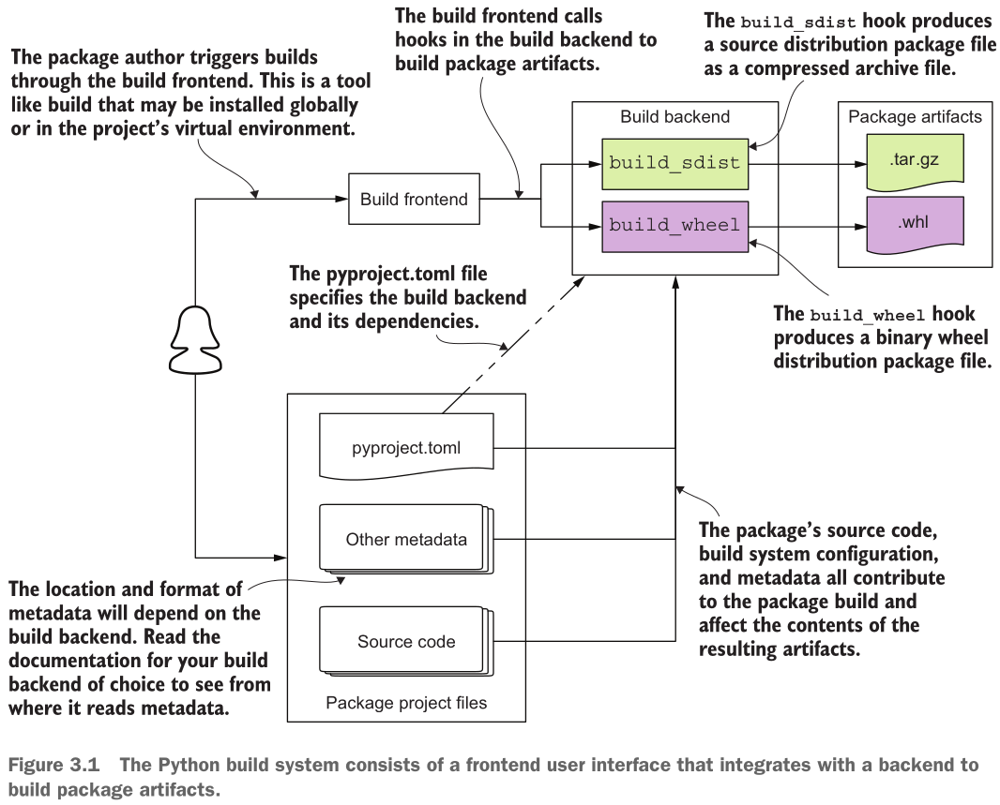

# Быстрое начало

Полдела откачало...

В корневой директории заметок уже есть [.python-version][pyversion] файл с опорной версией интерпретатора на проект (Python 3.14), которая и пригождается при создании и задействовании (активации) виртуальных окружений уже в конкретных диреткориях. Так, в директории "notes/ch01" можно создать виртуальное окружение используя `uv venv` или же `uv venv --python 3.12`  если нужна отличная версия интерпретатора.

```shell
╰─➤  uv venv
Using CPython 3.14.3
Creating virtual environment at: .venv
Activate with: source .venv/bin/activate
╭─X@D ~/Projects/Learning-Python-Packaging/notes/ch01  ‹add-ch03*›
╰─➤  source .venv/bin/activate
(ch01) ╭─X@D ~/Projects/Learning-Python-Packaging/notes/ch01  ‹add-ch03*›
╰─➤
```

Для (не)внимательных: да, я исправляю/переделываю первую главу в ветке для третьей - не совсем красиво, но ворочу мой проект как хочу.

Виртуальное окружение более чем  полезно, потому что именно в него можно поставить пригодные для конкретной задачи зависимости без загрязнения системы вообще. Вот и устанавливаю подобную зависимость - пакет [build][build]: `uv pip install build`.

```shell
╰─➤  uv pip install build
Resolved 3 packages in 517ms
Prepared 2 packages in 99ms
Installed 3 packages in 8ms
 + build==1.6.1
 + packaging==26.3
 + pyproject-hooks==1.3.3
(ch01) ╭─X@D ~/Projects/Learning-Python-Packaging/notes/ch01  ‹add-ch03*›
╰─➤  uv pip list
Package         Version
--------------- -------
build           1.6.1
packaging       26.3
pyproject-hooks 1.3.3
(ch01) ╭─X@D ~/Projects/Learning-Python-Packaging/notes/ch01  ‹add-ch03*›
╰─➤
```

Программа [build][build] - это фронтенд по установке Python программ. Фронтенд значит, что build предоставляет пользовательский интерфейс для сборки пакетов, но самой сборкой не занимается, а вызывает программы-бэкэнды, которые как умеют за сборку. Вот поясняющая картинка (взятая без разрешения, естественно) из книги "Publishing Python Packages":




Первая глава - это про малополезный "приветмирный" проект, который "сотворяю" посредством `uv init pack1` - это пока лишь про обустроенную (организованную) директорию проекта.

```shell
╰─➤  uv init pack1
Initialized project `pack1` at `~/Projects/Learning-Python-Packaging/notes/ch01/pack1`
(ch01) ╭─X@D ~/Projects/Learning-Python-Packaging/notes/ch01  ‹add-ch03*›
╰─➤  tree pack1
pack1
├── main.py
├── pyproject.toml
└── README.md

1 directory, 3 files
```

Оказывается, что uv создал проект "pack1" с наималодостаточными умоkчаниями, а значит его уже можно подврегнуть сборке и простой путь - это команда `uv build pack1`, выполняемая из директории "ch01".

```shell
╰─➤  uv build pack1
Building source distribution...
running egg_info
creating pack1.egg-info
writing pack1.egg-info/PKG-INFO
writing dependency_links to pack1.egg-info/dependency_links.txt
writing top-level names to pack1.egg-info/top_level.txt
writing manifest file 'pack1.egg-info/SOURCES.txt'
reading manifest file 'pack1.egg-info/SOURCES.txt'
writing manifest file 'pack1.egg-info/SOURCES.txt'
running sdist
running egg_info
writing pack1.egg-info/PKG-INFO
writing dependency_links to pack1.egg-info/dependency_links.txt
writing top-level names to pack1.egg-info/top_level.txt
reading manifest file 'pack1.egg-info/SOURCES.txt'
writing manifest file 'pack1.egg-info/SOURCES.txt'
running check
creating pack1-0.1.0
creating pack1-0.1.0/pack1.egg-info
copying files to pack1-0.1.0...
copying README.md -> pack1-0.1.0
copying main.py -> pack1-0.1.0
copying pyproject.toml -> pack1-0.1.0
copying pack1.egg-info/PKG-INFO -> pack1-0.1.0/pack1.egg-info
copying pack1.egg-info/SOURCES.txt -> pack1-0.1.0/pack1.egg-info
copying pack1.egg-info/dependency_links.txt -> pack1-0.1.0/pack1.egg-info
copying pack1.egg-info/top_level.txt -> pack1-0.1.0/pack1.egg-info
Writing pack1-0.1.0/setup.cfg
Creating tar archive
removing 'pack1-0.1.0' (and everything under it)
Building wheel from source distribution...
running egg_info
writing pack1.egg-info/PKG-INFO
writing dependency_links to pack1.egg-info/dependency_links.txt
writing top-level names to pack1.egg-info/top_level.txt
reading manifest file 'pack1.egg-info/SOURCES.txt'
writing manifest file 'pack1.egg-info/SOURCES.txt'
running bdist_wheel
running build
running build_py
creating build/lib
copying main.py -> build/lib
running egg_info
writing pack1.egg-info/PKG-INFO
writing dependency_links to pack1.egg-info/dependency_links.txt
writing top-level names to pack1.egg-info/top_level.txt
reading manifest file 'pack1.egg-info/SOURCES.txt'
writing manifest file 'pack1.egg-info/SOURCES.txt'
installing to build/bdist.linux-x86_64/wheel
running install
running install_lib
creating build/bdist.linux-x86_64/wheel
copying build/lib/main.py -> build/bdist.linux-x86_64/wheel/.
running install_egg_info
Copying pack1.egg-info to build/bdist.linux-x86_64/wheel/./pack1-0.1.0-py3.14.egg-info
running install_scripts
creating build/bdist.linux-x86_64/wheel/pack1-0.1.0.dist-info/WHEEL
creating '~/Projects/Learning-Python-Packaging/notes/ch01/pack1/dist/.tmp-iu7kuoho/pack1-0.1.0-py3-none-any.whl' and adding 'build/bdist.linux-x86_64/wheel' to it
adding 'main.py'
adding 'pack1-0.1.0.dist-info/METADATA'
adding 'pack1-0.1.0.dist-info/WHEEL'
adding 'pack1-0.1.0.dist-info/top_level.txt'
adding 'pack1-0.1.0.dist-info/RECORD'
removing build/bdist.linux-x86_64/wheel
Successfully built pack1/dist/pack1-0.1.0.tar.gz
Successfully built pack1/dist/pack1-0.1.0-py3-none-any.whl
```

Довольно длинная простыня, но в итооге создано два обменопригодных архива (оба в директории "pack1/dist"):

1. колесо (wheel) - на это нацелен pip и колесо считается основным форматом упаковки Python проекта;
2. архив .tar.gz, который называется source distribution (sdist), который наверное можно коряво перевести как "исходниковый раздаток" (ужас!) - ну пусть будет "издаток" если у нас ~~импорт~~ввозозамещение - его тоже полезно распоространять с колесом, но обойдусь пока этим объяснением.

Помимо "прямопутного" `uv build` имеются и другие тропки (попробуйте уже сами):

- `uvx --from build pyproject-build --installer uv pack1` - использовать команду pyproject-build как инструмент (tool, ведь uvx == uv tool run) из пакета build чтобы собрать проект pack1 посредством установщика uv.
- `python3 -m build --installer=uv pack1` - [здесь](https://build.pypa.io/en/stable/index.html#uv-build) эта команда заявлена "сущностно равнозначной" (essentially equivalent) команде `uv build`.

А далее собранные архивы можно установить через тот же `pip` (на это он и нужен). Можно установить через колесо:

```shell
╰─➤  uv pip install pack1/dist/pack1-0.1.0-py3-none-any.whl
Resolved 1 package in 3ms
Prepared 1 package in 8ms
Installed 1 package in 1ms
pack1==0.1.0 (from file:///.../Learning-Python-Packaging/pack1/dist/pack1-0.1.0-py3-none-any.whl)
╰─➤  uv pip list
Package         Version
--------------- -------
build           1.5.0
pack1           0.1.0
packaging       26.3
pyproject-hooks 1.2.0
╰─➤  uv pip uninstall pack1
Uninstalled 1 package in 24ms
- pack1==0.1.0 (from file:///.../Learning-Python-Packaging/pack1/dist/pack1-0.1.0-py3-none-any.whl)
```

Можно установить также из архива ".tar.gz":

```shell
╰─➤  uv pip install pack1/dist/pack1-0.1.0.tar.gz
Resolved 1 package in 6ms
      Built pack1 @ file:///.../Learning-Python-Prepared 1 package in 1.12s
Installed 1 package in 1ms
pack1==0.1.0 (from file:///.../Learning-Python-Packaging/pack1/dist/pack1-0.1.0.tar.gz)
╰─➤  python3
Python 3.14.3 (main, Mar  3 2026, 14:59:53) [Clang 21.1.4 ] on linux
Type "help", "copyright", "credits" or "license" for more information.
>>> import pack1
>>> quit()
╰─➤  uv pip uninstall pack1
Uninstalled 1 package in 5ms
 - pack1==0.1.0 (from file:///.../Learning-Python-Packaging/pack1/dist/pack1-0.1.0.tar.gz)
```

Вот такой "Привет мир" на уровне сборки, распространения и установки пакетов.

Также в pack1 создалась директория "pack1.egg-info" - это артефакт сборки посредством бэкэнда [setuptools][setuptools], к которому uv прибегает когда в проекте на сборку нет файла "pyproject.toml" или же в нём отсутствует раздел "\[build-backend\]". При запуске `uv init pack1`, в директории pack1 создаётся "pyproject.toml" следующего содержания:

```toml
[project]
name = "pack1"
version = "0.1.0"
description = "Add your description here"
readme = "README.md"
requires-python = ">=3.14"
dependencies = []
```

Но в этом файле нет раздела "\[build-backend\]", а значит, согласно [PEP-517](https://peps.python.org/pep-0517/):

> If the `pyproject.toml` file is absent, or the `build-backend` key is missing, the source tree is not using this specification, and tools should revert to the legacy behaviour of running `setup.py` (either directly, or by implicitly invoking the `setuptools.build_meta:__legacy__` backend).

Т.е. включается проброс к наследному (legacy) поведению, что и видно с первых строк сборки пакета pack1:

```shell
╰─➤  uvx --from build pyproject-build --installer uv pack1
Installed 3 packages in 4ms
* Creating isolated environment: venv+uv...
  Using external uv from /home/.../.local/bin/uv
* Installing packages in isolated environment:
  - setuptools >= 40.8.0
```

А зачем это так? В давние смутные времена безначалия и вседозволенности, опуская сведения про distutils и прочие бубнопляски с архивами и установочными скриптами, проект [setuptools][setuptools] предложил свой формат яйца (egg) - zip-архив, который содержит исходники и метаданные проекта. Но яйца так и не вкатились в экосистему Python, а колёса "вкатились" благодаря [PEP-427](https://peps.python.org/pep-0427/) и дальнейшим усилиям по стандартизации сборки и упаковки Python программ.

Вот теперь достаточно для первой главы, но также оставляю дополнительную заметку по формату [TOML](https://toml.io/en/v1.0.0) (без средств обхода сетвых "запоров" в РФ открывается слабо). TOML, или "Tom's Obvious, Minimal Language" (сам себя похвалил, вписал в историю и не осуждаю парнягу), как раз и составляет содержимое файла pyproject.toml (см. [PEP-621](https://peps.python.org/pep-0621/)) и который нацелен быть единым источником правды и метаданных Python-проекта.

[pyversion]: ../../.python-version
[build]: https://pypi.org/project/build/
[setuptools]: https://setuptools.pypa.io/
