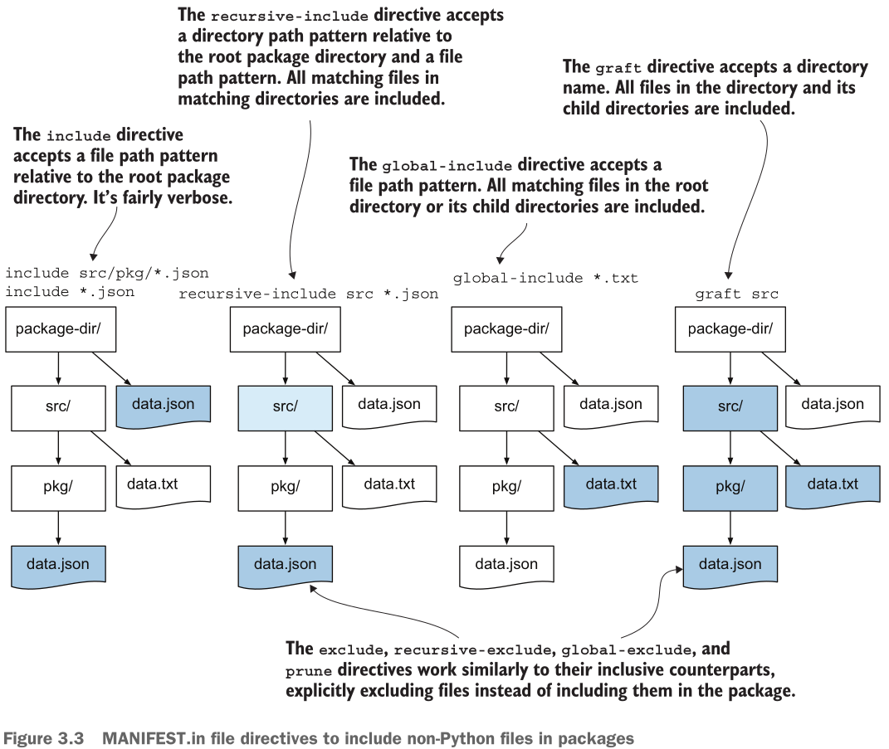

# Дополнительные трудности сборки

И снова с пустоместа и сразу ныр в глубины без приповерхностных плаваний.

## Содержание

- [Снова здарова](#снова-здарова)
- [Данные пакета](#данные-пакета)
- [MANIFEST.in](#manifestin)
- [Итоги](#итоги)

### Снова здарова

Снова создаю пустой проект ("expack2"), наполняю его и вырастает такое дерево:

```shell
╰─➤  tree
.
├── expack2
│   └── __init__.py
├── pictures
│   ├── Building-Empty-Python-Packages.png
│   ├── Manifest-in-directives.png
│   ├── Python-build-system.png
│   ├── Python-Venv_maps.png
│   └── Venvs.png
├── pyproject.toml
└── tests
    └── __init__.py

4 directories, 8 files
```

Файл pyproject.toml пока такой:

```toml
[build-system]
requires = ["setuptools ~= 84.0"]  # the frontend should install them automatically
build-backend = "setuptools.build_meta"  # the path to the backend program

[project]
name = "expack2"
version = "0.2.1"
description = "A sample Python extra package v2"
requires-python = "~=3.14.0"
```

Основное отличие, что в проекте несколько директорий и вот вопрос: "сумеет ли бэкэнд определить где исходники, а где "непитонячьи" файлы?" Чего гадать, когда можно проверить на деле:

```shell
╰─➤  uv build
Building source distribution...
error: Multiple top-level packages discovered in a flat-layout: ['expack2', 'pictures'].

To avoid accidental inclusion of unwanted files or directories,
setuptools will not proceed with this build.

If you are trying to create a single distribution with multiple packages
on purpose, you should not rely on automatic discovery.
Instead, consider the following options:

1. set up custom discovery (`find` directive with `include` or `exclude`)
2. use a `src-layout`
3. explicitly set `py_modules` or `packages` with a list of names

To find more information, look for "package discovery" on setuptools docs.
error: Failed to build
       `~/Projects/Learning-Python-Packaging/notes/ch02/extra/expack2`
  Caused by: The build backend returned an error
  Caused by: Call to `setuptools.build_meta.build_sdist` failed (exit status:
             1)

hint: Build failures usually indicate a problem with the package or the build environment
```

Не случилось и простыня довольно подробная: setuptools просто не знает что включать в сборку, а что нет, ведь директорий-кандидатов не одна, а уже две, а значит налицо неочевидность. Что предлагает:

- src расклад (layout) - пока я не хочу к нему прибегать, ибо и плоский (flat) расклад вполне живуч в Python мире, хотя есть обсуждение и тонкости за "src-vs-flat", но пока не о них речь - считайте, что есть требование делать именно плоский расклад.
- раз src-расклад не в чести, остаётся явно указать где искать пакеты и что есть пакеты.

Решение однозначно: добавить в pyproject.toml:

```toml
[tool.setuptools]
packages = ["expack2"]
```

При этом не нужно делать явный exclude директории "pictures", ибо уже указан нужный пакет. Но что если я хочу поставлять также директорию "pictures"? Это же не пакет, но пусть она настолько важна, что её стоит включать в архивы. Оказывается, есть несколько способов это сделать и рассмотрим их в отдельных подглавах.

Кстати, эти картинки снова слямзены из книги "Publishing Python Packages" и снова без разрешения, но уж больно хороша книга, а ссылку на неё смотри в корневом README проекта.

### Данные пакета

Сиречь package data на туманальбионском. Можно переместить директорию "pictures" в пакет "expack2" и указать её как данные пакета. Тогда нужно добавить в pyproject.toml следующее:

```toml
[tool.setuptools.package-data]
expack2 = ["pictures/*.png"]  # wanna include 'em all
```

В документации setuptools [написано](https://setuptools.pypa.io/en/latest/userguide/datafiles.html#configuration-options), что с версии v61 можно не прописывать `include-package-data = true` в разделе `[tool.setuptools]` ибо такое поведение по умолчанию (но не для setup.py или setup.cfg). х [Здесь](https://setuptools.pypa.io/en/latest/userguide/datafiles.html#package-data) поясняется, что при `include-package-data = true`, все непитоновские файлы внутри пакета обнаруживаются и включаются в пакет (а за тонкостями проследуйте к документации).

```shell
╰─➤  tree
.
├── expack2
│   ├── __init__.py
│   └── pictures
│       ├── Building-Empty-Python-Packages.png
│       ├── Manifest-in-directives.png
│       ├── Python-build-system.png
│       ├── Python-Venv_maps.png
│       └── Venvs.png
├── pyproject.toml
└── tests
    └── __init__.py

4 directories, 8 files
```

Архивы расположил в директории [dists/v1](./dists/v1).

Вообще картинки трудно считать данными пакета, если только они не являются ценными "исчерпывающими" времени исполнения (runtime resources): вдруг их нужно выдавать и в этом мулька самой программы, и такое бывает. Пример надуманный, но, например, на моей работе в одном проекте есть CSV-файл, где указаны разновидности коммерческих услуг. По историческим причинам, сведения по услугам хранятся не в БД, а именно в файле на стороне сервиса - этот файл содержит данные пакета и они деятельно используются в бизнес-логике.

### MANIFEST.in

Если директория с картинками не предназначена быть данными пакета, а скорее побочные, но всё же связные, данные, тогда можно оставить директорию в корне, но "пронаставить" setuptools включать оную в архив, хотя бы в sdist и для этого как разу и требуется файл "MANIFEST.in".

```shell
╰─➤  tree
.
├── expack2
│   └── __init__.py
├── MANIFEST.in
├── pictures
│   ├── Building-Empty-Python-Packages.png
│   ├── Manifest-in-directives.png
│   ├── Python-build-system.png
│   ├── Python-Venv_maps.png
│   └── Venvs.png
├── pyproject.toml
└── tests
    └── __init__.py

4 directories, 9 files
```

И здесь сборка показала отличия: в тарбол картинки попали, а в колесо нет - да что за не так?! Да как раз всё так, ибо файл MANIFEST.in - это про наполнение "исходникового раздатка" (sdist), а не колеса. Поскольку картинки теперь не в директории пакета, а смежно ему в корне, то картинки просто не могут считать данными пакета ибо не находятся внутри пакета.

Более того, "издаток" и колесо - это разные артефакты: первый - исходный архив, а второй - "раздаток" (дистрибутив). Колесо не обязано точно воспроизводить архив проекта, колесо как раз для установки пакета и перегруженным его делать не следует. И потом, что "исходниковый архив", что колесо обычно поставляют совместно и при случае недостающие данные можно выцепить как раз из тарбола и именно там им место как допданным, но явно не в целевом установочном архиве (колесе).

Посему, если важно поставить данные, но они скорее сопутствующие и не обязаны быть в итоговом поставляемом изводе (версии) проекта, то смело пользуйте файл "MANIFEST.in" и ничего страшного в ещё одном "лишнем" файле.

Вот хорошая картинка (и снова без разрешения):



И тонкость: setuptools смотрет на "MANIFEST.in", а не "MANIFEST" без расширения ([ссылка](https://setuptools.pypa.io/en/latest/userguide/miscellaneous.html#using-manifest-in)).

### Итоги

Этих двух способов хватит на эту заметку. Если вкратце, то:

- непитоновские файлы могут и должны использоваться пакетом - включайте их внутрь пакета и
package data в помощь
- если данные сопутствующие и не являются данными пакета, то используйте "MANIFEST.in" - будут в тарболе, не будут в колесе и возможно так и нужно.
