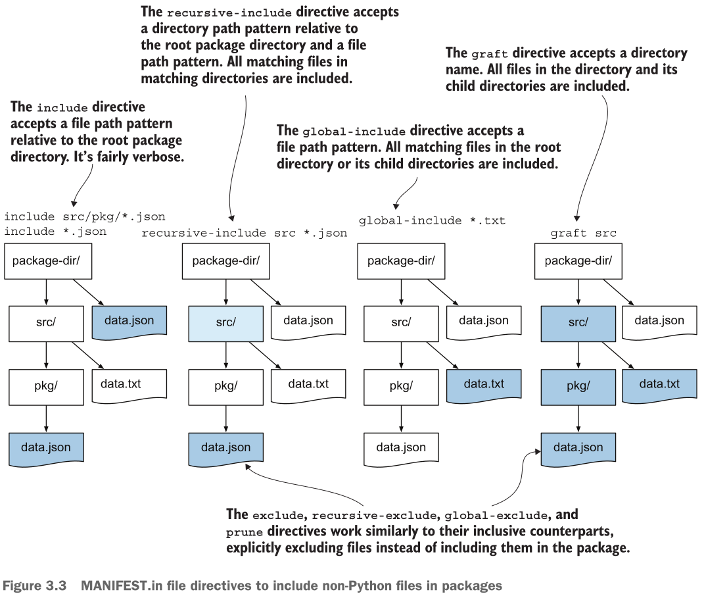

Создаю директорию `pack2` и делаю `uv build pack2`:

```shell
╰─➤  uv build
╰─➤  uv build pack2
Building source distribution...
error: Failed to build
       `.../Learning-Python-Packaging/notes/ch02/pack2`
  Caused by: .../Learning-Python-Packaging/notes/ch02/pack2
             does not appear to be a Python project, as neither
             `pyproject.toml` nor `setup.py` are present in the
             directory
```

Понятно что делать - создаю `pyproject.toml` (ибо [PEP-621][pep621]) в директории `pack2`.

```shell
╰─➤  uv build pack2
Building source distribution...
warning: `.../Learning-Python-Packaging/notes/ch02/pack2` does not appear to be a Python project, as the `pyproject.toml` does not include a `[build-system]` table, and neither `setup.py` nor `setup.cfg` are present in the directory
running egg_info
creating UNKNOWN.egg-info
writing UNKNOWN.egg-info/PKG-INFO
writing dependency_links to UNKNOWN.egg-info/dependency_links.txt
writing top-level names to UNKNOWN.egg-info/top_level.txt
writing manifest file 'UNKNOWN.egg-info/SOURCES.txt'
reading manifest file 'UNKNOWN.egg-info/SOURCES.txt'
writing manifest file 'UNKNOWN.egg-info/SOURCES.txt'
running sdist
running egg_info
writing UNKNOWN.egg-info/PKG-INFO
writing dependency_links to UNKNOWN.egg-info/dependency_links.txt
writing top-level names to UNKNOWN.egg-info/top_level.txt
reading manifest file 'UNKNOWN.egg-info/SOURCES.txt'
writing manifest file 'UNKNOWN.egg-info/SOURCES.txt'
running check
warning: sdist: standard file not found: should have one of README, README.rst, README.txt, README.md

warning: check: missing required meta-data: name

creating unknown-0.0.0
creating unknown-0.0.0/UNKNOWN.egg-info
copying files to unknown-0.0.0...
copying pyproject.toml -> unknown-0.0.0
copying UNKNOWN.egg-info/PKG-INFO -> unknown-0.0.0/UNKNOWN.egg-info
copying UNKNOWN.egg-info/SOURCES.txt -> unknown-0.0.0/UNKNOWN.egg-info
copying UNKNOWN.egg-info/dependency_links.txt -> unknown-0.0.0/UNKNOWN.egg-info
copying UNKNOWN.egg-info/top_level.txt -> unknown-0.0.0/UNKNOWN.egg-info
Writing unknown-0.0.0/setup.cfg
Creating tar archive
removing 'unknown-0.0.0' (and everything under it)
Building wheel from source distribution...
running egg_info
writing UNKNOWN.egg-info/PKG-INFO
writing dependency_links to UNKNOWN.egg-info/dependency_links.txt
writing top-level names to UNKNOWN.egg-info/top_level.txt
reading manifest file 'UNKNOWN.egg-info/SOURCES.txt'
writing manifest file 'UNKNOWN.egg-info/SOURCES.txt'
running bdist_wheel
running build
installing to build/bdist.linux-x86_64/wheel
running install
running install_egg_info
running egg_info
writing UNKNOWN.egg-info/PKG-INFO
writing dependency_links to UNKNOWN.egg-info/dependency_links.txt
writing top-level names to UNKNOWN.egg-info/top_level.txt
reading manifest file 'UNKNOWN.egg-info/SOURCES.txt'
writing manifest file 'UNKNOWN.egg-info/SOURCES.txt'
Copying UNKNOWN.egg-info to build/bdist.linux-x86_64/wheel/./UNKNOWN-0.0.0-py3.14.egg-info
running install_scripts
creating build/bdist.linux-x86_64/wheel/unknown-0.0.0.dist-info/WHEEL
creating '.../Learning-Python-Packaging/notes/ch02/pack2/dist/.tmp-d729403z/unknown-0.0.0-py3-none-any.whl' and adding 'build/bdist.linux-x86_64/wheel' to it
adding 'unknown-0.0.0.dist-info/METADATA'
adding 'unknown-0.0.0.dist-info/WHEEL'
adding 'unknown-0.0.0.dist-info/top_level.txt'
adding 'unknown-0.0.0.dist-info/RECORD'
removing build/bdist.linux-x86_64/wheel
Successfully built pack2/dist/unknown-0.0.0.tar.gz
Successfully built pack2/dist/unknown-0.0.0-py3-none-any.whl
```

Это довольно-таки длинная простыня и предупреждения (warnings) достойны прочтения. С пустым "pyproject.toml" сделаешь ничего путного, но [руководство по написанию pyproject.toml][writepyproject] поможет. Файл пишу сам, чтобы поупражняться, а в качестве бэкэнда выбрал [setuptools][setuptools] по нескольким причинам:

- старый, но зрелый и поддерживаемый проект (но это не главное);
- он может посмотреть в файл "setup.py", в котором можно программно доуказать что и как ставить, особенно когда нужно установить расширения (например, C/C++), [Cython][cython]'изировать проект и т.п. - т.е. поиграться с ним сейчас мне выгодно, чтобы потом не заморачиваться со сборкой проектов, которые опираются на Cython чтобы писать на Python-подобном языке модули, которые будут переведены в Си-расширения (которые зачастую высокопроизводительнее чем природные Python модули)
- а ещё к нему скатывается сборка проекта когда нет pyproject.toml или же в нём нет раздела build-backend (это обмолвлено в [первой главе](../ch01/pack1.md) моих заметок)

Перед сборкой проекта хорошо обратить внимание на предупржедения от прошлой сборки:
1. создать файл README.md
2. прописать name и requires-python поля в "pyproject.toml"
3. обращать внимание на предупреждения при последующих сборках

А чтобы включить разные дополнительные файлы, используется файл "MANIFEST.in", он также будет включён и в sdist, и в wheel. Также прилагаю картинку из книги "Publishing Python Packages" (и снова без разрешения, но зато с указанием откуда, так что идите налево все любители авторского права):



И да, "data/config.json" как не-Python файл, но прописанный в MANIFEST.in попал в издаток (sdist), но не попал в колесо (wheel) и это прравильно, потому что data не лежит внутри example, а значит не является данными пакета (package data), а значит и включать их в колесо незачем.

А ещё нейронка помогла в вопросе когда временно исключил директиву `global-include *.txt`, а в сборку "example/subpack/note.txt" всё равно попал и прилагаю её (Yandex Alice) ответ:

> Когда setuptools собирает sdist, он создаёт (или обновляет) папку example.egg-info/, а в ней — файл SOURCES.txt со списком всех файлов для sdist. При повторной сборке setuptools читает существующий SOURCES.txt и обновляет его, а не создаёт с нуля. 
> 
> Если вы ранее собирали sdist с правилом, включавшим note.txt (например, recursive-include example *.txt), то note.txt попал в SOURCES.txt. После удаления правила из MANIFEST.in и пересборки без очистки egg-info/ — старая запись осталась, и файл снова попал в архив. ([ссылка](https://github.com/tekumara/notes/blob/main/setuptools.md))

А ещё выручает `uv build --no-cache` - запускать сборку без учёта кэша. В общем, архивы оставлены, можно попытаться восстановить из них строение проекта, но точку опоры оставлю всё же:

```shell
╰─➤  tree
.
├── data
│   └── conf.json
├── example
│   ├── cli.py
│   ├── __init__.py
│   ├── __main__.py
│   └── subpack
│       ├── __init__.py
│       ├── module.py
│       └── note.txt
├── LICENSE.md
├── MANIFEST.in
├── pyproject.toml
├── README.md
├── tests
│   ├── __init__.py
│   └── test_echo.py
└── uv.lock

5 directories, 14 files
```

Успехов в распаковке.

[pep621]: https://peps.python.org/pep-0621/
[writepyproject]: https://packaging.python.org/en/latest/guides/writing-pyproject-toml/
[setuptools]: https://pypi.org/project/setuptools/
[cython]: https://pypi.org/project/Cython/
