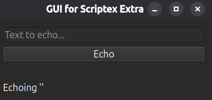

# Добавление GUI-модуля

В основной заметки сделано простое CLI эхо-приложение, а в этой, в качестве добавки, будет положен модуль с графическим интерфейсом пользователя (Graphical User Interface, GUI).

На самом деле потребуется мало изменений:

- я решил изменить имя пакета с clap на scriptex,ибо здесь про скрипты уже больше -> пришлось поменять имена во "внесках" (импортах);
- добавить зависимость - пусть [PyQT6](https://pypi.org/project/PyQt6/) -> `uv add --optional gui PyQT6` (мне пришлось также использовать флаг `--active`);
- естественно обновить "доп" (extra) all -> `all = scriptex[cli,gui]` в pyproject.toml;
- добавить сам модуль "gui.py" c реализацией эхо-оконкой (оконным приложением) -> просто напряг нейронку;
- указать путь к скрипту в pyproject.toml -> иначе при установке не создастся "терминальная" команды.

В общих чертах как-то так. [Здесь](https://docs.astral.sh/uv/guides/scripts/#using-gui-scripts) можно посмотреть за использование GUI-скриптов в uv. Также мне не приходится возится с приколюхами Windows, поэтому за подробностями в официальную доку.

Итоги:

```shell
╰─➤  uv pip install -e ".[all]"
Using Python 3.14.3 environment at: ~/Projects/Learning-Python-Packaging/notes/ch03/.venv
Resolved 8 packages in 240ms
      Built scriptex @ file: ~/Projects/Learning-PPrepared 1 package in 678ms
Uninstalled 1 package in 0.81ms
Installed 1 package in 2ms
 ~ scriptex==0.3.1 (from file:~/Projects/Learning-Python-Packaging/notes/ch03/extra/epack3)
╰─➤  python3 -m scriptex
Echoing 'I am the main (entry) module'
╰─➤  echo-cli -m PyPackaging
Echoing 'PyPackaging'
╰─➤  echo-gui
```

И далее терминал западает пока оконка открыта.



На пустой строке не сломалось и уже хорошо)
